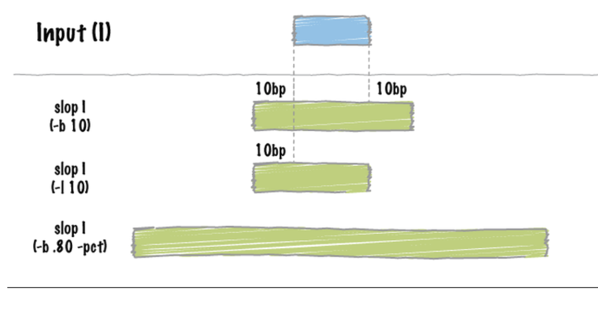

title: \sf Lecture 1 - RNA-Seq analysis step-by-step
header-includes:
- \usepackage{color}
- \usepackage{float}
- \DeclareUnicodeCharacter{2212}{-}
date: "Sept. 6, 2023"
output:
  bookdown::html_document2:
    toc: true
fontsize: 14pt
geometry: margin=1in

# Last Time:

## Review of analysis pipeline

# TODAY: de novo Motif searching with MEME

## MEME: Multiple Em for Motif Elucidation


MEME Website: [http://meme-suite.org/](http://meme-suite.org/)

 

```{r engine='bash', eval=F, echo=TRUE}
fastaFromBed -fi GENOME.fa -bed SUMMITS_100bp.bed -fo SUMMITS_100bp.fa
#-name: Will use the 'name' column from bed file to name sequence
#-fi: Input fasta sequences to retrieve interval sequences from
#-bed: Input bed file
#-fo: Output fasta file
```

